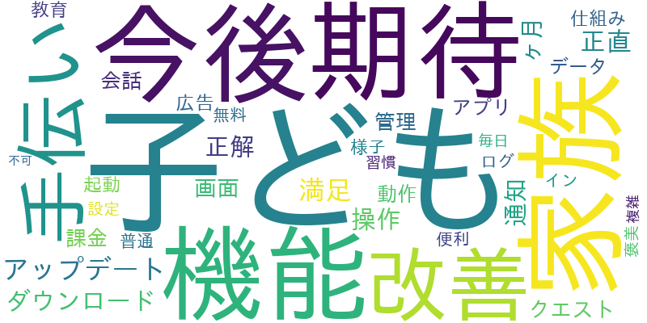

# ポートフォリオ — KIKUCHI, Toru（菊池 亨）

> **教育現場16年で培った「観察→データ→示唆」の力で、現場の課題をデータと仕組みで解決する。**
> 公立学校で教育DXを主導しながら、現場の「負」をデータと仕組みで解決してきました。

* Python（MeCab）による形態素解析でアンケート等の定性データを定量化・可視化し、エビデンスに基づく意思決定を支援。
* SQLでのデータ集計やLooker StudioでのBIダッシュボード制作まで、データの収集→可視化→考察を実践しています。
* 250名規模の組織のICT環境運用（ネットワーク機器・アカウント管理）、Excel VBA／GASによるRPA内製化（年間約200時間の削減）、自社開発レベルのWebプロダクト制作まで、**分析を支える実装・DXの土台**も備えています。

| | |
| :-- | :-- |
| 🎯 **専門領域** | データ分析・BI（SQL・Python・Looker Studio）／業務自動化・DX／フルスタック内製開発 |
| 🧭 **得意領域** | データの定量化・可視化／SQL・Python／要件定義・業務設計／業務自動化（GAS・VBA） |
| ♿ **大切にしていること** | 数字の背景にある「人」を見る視点・データ整合性・属人化排除のドキュメント文化 |
| 📄 **詳細** | [職務経歴書（RESUME.md）](./RESUME.html) |

### 💡 データ領域で提供できること

- **データ分析・可視化** — SQL集計 → Looker Studio でのBI構築 → Python（形態素解析・機械学習）で定性データを定量化し、**意思決定に使える示唆** まで一貫して対応
- **業務自動化・DX** — GAS／Excel VBA で定型業務を自動化（実績：**年間約200時間削減**）。データ収集・集計を仕組み化
- **内製開発（分析を支える土台）** — 要件定義〜Next.js／Supabase（SQL）〜デプロイまで一人で完結。分析基盤やツールを自前で構築

### 業務実績ハイライト

- **250名規模の組織**で情報システム（ICT環境）の企画〜運用までを一気通貫で担当
- Excel VBA／GASによるRPA内製で **年間約200時間（約40%）の業務効率改善** を実現
- **端末100台規模の更新プロジェクト** を要件定義〜ベンダー選定〜定着支援まで主導（教育委員会との折衝・校長決裁による合意形成を含む）
- Python（MeCab）による形態素解析で、アンケート等の定性データを定量化・可視化
- **アカウント・権限管理の運用ルールと手順書を整備**し、セキュリティポリシー策定とあわせてITガバナンスを向上
- AAC／AT（視線入力・スイッチインターフェイス）導入による **アクセシビリティ環境の個別最適化**

#### 📊 RPA内製化の KPI（工数ベース）

外注が難しい校務システムを **内製化** し、定型業務を自動化。 効果は実測した **工数（時間・人月）** で示します。

| 指標（対象：250名規模組織の定型業務） | Before | After | 効果 |
| :-- | :-- | :-- | :-- |
| 定型業務の年間工数 | 約500時間 | 約300時間 | **▲約200時間/年（−40%・毎年継続）≒ 年1.25人月** |
| 開発規模 | 外注なら 3人 × 2か月＝**6人月**規模（かつ外注不可） | **1人 × 20日（≒1人月）で内製** | 6人月規模を1人月で内製 |

- 外注が難しい案件を **内製で実現**（＝内製化しなければ自動化そのものが進まなかった）
- 一度の内製（約160時間）で、以後 **毎年約200時間を継続削減**

> ※ 学校現場のため、外注費・金額ベースのROIは算出していません（一般企業とコスト構造が異なるため）。効果は工数で計測しています。金額ベースのROI試算ツールは別途 [roi-simulator](https://roi-simulator-delta.vercel.app) として制作しています。

---

## 🛠 技術スタック

| 分類 | 技術 |
| :-- | :-- |
| 言語 | TypeScript / JavaScript / Python / Swift / SQL |
| フロントエンド | React 19 / Next.js (App Router) / Tailwind CSS / shadcn/ui / HTML / CSS |
| バックエンド | Supabase (PostgreSQL / Auth / Row Level Security / Edge Functions) |
| AI / データ | Anthropic Claude API / Python (MeCab) による形態素解析・機械学習 |
| モバイル | React Native / Expo |
| 業務自動化 / RPA | Excel VBA / Google Apps Script (GAS) |
| インフラ / 運用 | Vercel (CI/CD) / GitHub / Windows Server |
| コラボレーション基盤 | Microsoft Teams / Google Workspace（チャネル設計・権限設定・研修） |
| 設計ドキュメント | 要件定義書・ER図・UX監査・マイグレーション設計・運用手順書 |

---

## ⭐ 代表プロダクト — おてつだいバンク

子供向けの「お手伝い×マネー教育」アプリ。お手伝いをRPGのクエストに見立て、稼いだお金を **「つかう／ためる／ふやす」** の3つに分けることで、楽しみながら **お金との付き合い方を身につける** 学習体験を提供します。

[🔗 ライブデモ](https://otetsudai-bank-beta.vercel.app) ・ [🍎 TestFlight（iOS）](https://testflight.apple.com/join/CYw3kWBd) ・ [📁 リポジトリ](https://github.com/TK20260401/otetsudai-bank)

**主な機能**
- 3役認証（管理者／保護者／子供＝PIN）と保護者ダッシュボードでのタスク管理・承認フロー
- ウォレットの3分割（つかう／ためる／ふやす）、貯金ゴール、達成バッジによる行動設計
- 株式ポートフォリオ・シミュレーター（日経225／S&P500など全14銘柄）
- AIアドバイザー（子供向け／保護者向け／ガイドの3モード、Anthropic Claude API）
- RPG要素（レベル・ペット育成・ダンジョンバトル）でモチベーション維持を設計
- ユニバーサルデザイン（色＋アイコン併用・ふりがな・大きなタップ領域、WCAG AA水準）

**技術・設計のポイント**
- Next.js 16 (App Router) / React 19 / TypeScript / Tailwind CSS / shadcn/ui
- Supabaseの15テーブルに **Row Level Securityを全面適用**
  - PINは **bcryptでハッシュ化**
- 子供向けサービスゆえの **COPPA／GDPRを意識したプライバシー設計**
- 約96コミットでv0.1→v0.22まで反復開発。
  - 要件定義・ER図・UX監査・マイグレーション設計をドキュメント化

---

## 🎓 学びを“設計”する — 制作の背景

学習アプリ群は単なる練習問題集ではなく、**「なぜ作るのか」** という問いから設計しています。

- **簿記・会計領域** — 自ら **会計ソフトを開発** 
  - 開発過程で必要になった実務知識を、そのまま学習ツールへ。「作りながら学ぶ」を地で行く制作。
- **情報処理領域** — **自己デザイン**（学習者が自ら主体的に学ぶ）の思想に基づく。
  - 答えを与えるのではなく、`試す・トレースする・自ら気づく`プロセスを設計。

---

## 📦 プロジェクト一覧

### 📊 データ分析・AI

| プロジェクト | 概要 | 主な技術 | リンク |
| :-- | :-- | :-- | :-- |
| **利用状況ダッシュボード** | おてつだいバンクの利用状況を可視化したBIダッシュボード（学習用サンプルデータによる分析デモ） | Looker Studio / データ可視化 | [Demo](https://lookerstudio.google.com/reporting/467c397b-49be-4a1b-a759-a46fcccc383b) |
| **otetsudai-nlp** | アプリレビューを日本語形態素解析＋機械学習で肯定/否定に自動分類（学習用サンプル・**入力文をその場判定する対話デモ付き**） | Python / fugashi(MeCab) / scikit-learn | [解説 ▼](#-機械学習で日本語レビューを肯定否定に自動分類otetsudai-nlp) |
| **ai-strategy-agent** | AIを活用した戦略立案支援エージェント | TypeScript | [Repo](https://github.com/TK20260401/ai-strategy-agent) |

### 🚀 プロダクト・業務系Webアプリ

| プロジェクト | 概要 | 主な技術 | リンク |
| :-- | :-- | :-- | :-- |
| **otetsudai-bank** | 子供向けお手伝い×マネー教育アプリ（代表作） | Next.js / Supabase / Claude API | [Demo](https://otetsudai-bank-beta.vercel.app) ・ [TestFlight](https://testflight.apple.com/join/CYw3kWBd) ・ [Repo](https://github.com/TK20260401/otetsudai-bank) |
| **report-hub** | 日報／週報／月報を一元管理し、業務効率と知見を蓄積するハブ | TypeScript / Next.js | [Demo](https://report-hub-one.vercel.app) ・ [Repo](https://github.com/TK20260401/report-hub) |
| **asset-management-ledger** | QRコード対応の資産管理台帳。更新アラート・操作ログ・権限管理 | TypeScript / Next.js | [Demo](https://asset-management-ledger.vercel.app) ・ [Repo](https://github.com/TK20260401/asset-management-ledger) |
| **roi-simulator** | 売上計画とROIを即時試算・複数プラン比較 | HTML / JS | [Demo](https://roi-simulator-delta.vercel.app) ・ [Repo](https://github.com/TK20260401/roi-simulator) |
| **otetsudai-quest-mobile** | おこづかいクエストのモバイル版 | React Native / Expo | [Repo](https://github.com/TK20260401/otetsudai-quest-mobile) |

### 🎓 情報処理・学習教育系

| プロジェクト | 概要 | 主な技術 | リンク |
| :-- | :-- | :-- | :-- |
| **zensho-algo** | 全商情報処理検定 アルゴリズム完全攻略トレーナー。擬似言語の変数トレース・フローチャート変換 | TypeScript / Next.js | [Demo](https://zensho-algo-app.vercel.app) ・ [Repo](https://github.com/TK20260401/zensho-algo-app) |
| **ipas-master** | ITパスポート対策アプリ。500問ドリル・分野別フィルタ・レーダーチャート分析・進数変換 | TypeScript / Next.js | [Demo](https://ipas-master.vercel.app) ・ [Repo](https://github.com/TK20260401/ipas-master) |
| **logic-riichi** | 麻雀の待ち牌当てでアルゴリズム的思考を鍛える学習クイズ | TypeScript / Next.js | [Demo](https://logic-riichi.vercel.app) ・ [Repo](https://github.com/TK20260401/logic-riichi) |
| **ISLOS（IT-Skills Learning OS）** | 情報処理学習アプリ（FE計算/ITパスポート/アルゴリズム）を束ねるポータル＋構想 | ポータル / 設計 | [ポータル](https://tk20260401.github.io/islos/) ・ [設計](https://github.com/TK20260401/20260401-Project-Blueprint) |

### 🎮 その他

| プロジェクト | 概要 | 主な技術 | リンク |
| :-- | :-- | :-- | :-- |
| **universal-games** | 誰でも楽しめるアクセシブルなゲーム集（あそびひろば） | TypeScript / Expo | [Repo](https://github.com/TK20260401/universal-games) |
| **clock** | NHK風時計アプリ（アナログ時計＋天気＋タイマー） | HTML / CSS / JS | [Repo](https://github.com/TK20260401/clock) |
| **tetris-games** | ブラウザで遊べるテトリス | HTML / JS | [Demo](https://tetris-games-six.vercel.app) ・ [Repo](https://github.com/TK20260401/tetris-games) |

### 🚧 開発中 / 構想中
- **簿記・ビジネス会計トレーナー** 
  - — 仕訳→試算表→精算表→決算書の自動採点、決算整理、財務分析12指標、CVP・損益分岐点、減価償却、株式指標、ドリル、進捗ダッシュボードを備えた学習アプリ。
  - 現在 **デスクトップアプリ版・Webアプリ版** を計画中（教育現場での自作教材が原型）。

---

## 🧠 機械学習で日本語レビューを肯定/否定に自動分類（`otetsudai-nlp`）

> **学習用の架空サンプルデータによるデモです**（実ユーザーのレビューではありません。誇張を避けるため明記）。

おてつだいバンク（架空）のアプリレビュー400件を題材に、**日本語テキストを形態素解析 → 可視化 → 機械学習で肯定/否定を自動分類** する一連の流れを Python で実装しました。SQL×BI の分析プロジェクトの **Python 版** にあたります。

| ステップ | やったこと | 使用技術 |
| :-- | :-- | :-- |
| 形態素解析 | レビューから名詞を抽出して頻出語を可視化。**肯定＝家族・手伝い・満足／否定＝アップデート・通知・課金** と語彙がきれいに対照的 | fugashi（MeCab）/ wordcloud |
| 機械学習 | 内容語を基本形に正規化 → TF-IDF でベクトル化 → ロジスティック回帰で肯定/否定を二値分類。**特徴語から判定根拠も確認** | scikit-learn |
| 体験デモ | 入力した文章をその場で肯定/否定判定（**確信度つき**）するスクリプトを同梱 | Python |

- **満足は「体験」、不満は「技術・課金」に集中** — 否定語の上位がアップデート/通知/課金/データ消失。プロダクト価値そのものより、安定性・通知設計・課金バランスが解約リスクの主因という仮説が立つ。
- 分類精度は高く出ますが、これは**サンプルデータが肯定/否定で語彙が明確に分かれている易しい条件**のため。実レビュー（皮肉・条件付き評価・誤字）では精度が下がる点も正直に記載しています。

---

## 📚 教育現場での教材開発アーカイブ（2019〜2025）

特別支援学校・夜間定時制高校での情報科担当 **16年間** で蓄積した、**自作の授業教材・学習プログラム群**。 これらが現在のプロダクト開発における「**教材化 ＝ 学びの設計**」スキルの土台になっています。

### 🧑‍🏫 プログラミング教育
- **C言語** — 全15単元構成の授業資料（PDF）と科目試験（前期・後期）
- **VBA / Excel マクロ** — ジャンケン、コンピュータ α/β/γ、回数最大化シミュレーションなど対戦アルゴリズム教材
- **Python 基礎（`min_py` シリーズ）** — Argument / Branch / Class / Comprehension / Constructor … 概念ごとの単元別 Jupyter Notebook
- **Python 応用** — openpyxl による Excel 自動化、BeautifulSoup / Selenium / Requests による Web スクレイピング、3章構成のアルゴリズム教材
- **高校情報I** — Google Colaboratory ベースの大学入試対策教材
- **構造化プログラミング** — 順次・選択・繰り返し・関数・配列を docx 教材化（事例ベース）

### 🤖 データサイエンス / AI
- **データサイエンス入門** — 第2〜6章（Python基礎・データ収集・前処理・確率統計）
- **AI 応用** — 第10〜14章（分類 AI / クラスタリング / レコメンド / 時系列・NLP / 画像分析）
- **統計可視化** — 分散と標準偏差、投球散布図、3次元マッピング、シミュレーション
- **機械学習 Colab Notebooks** — `python_basic_1〜4`、`draw_functions`、`exercise` 等の演習ノート群

### 📝 検定・試験対策
- **ITパスポート** — STUDYing 連携の独自対策ノート
- **ICT 支援員** — 過去問対策資料
- **教員採用試験（令和7年度）** — 受験者支援資料

### ♿ 特別支援教育
- **SST（ソーシャルスキルトレーニング）ワークシート** — 障害特性に合わせた自作教材
- **手話学習資料** — しゅわしゅわ村（動物・乗り物編）、医療手話、スポーツ手話、地名手話マップ など
- **手話表現試験** — 評価基準・実技課題資料

### ⚙️ 業務効率化 / RPA
- **PythonExcel カリキュラム（全8章）** — openpyxl での Excel 操作を体系化
  - 第1章: メール送信入門 / 第2章: Python 基礎演習
  - 第3章: Excel 読み書き・作成・シートコピー / 第4章: ブックコピー・置換・グループ分け
  - 第5章: 書式・関数 / 第6章: CSV・テキスト集約、Excelコピーツール
  - 第7章: Wikipedia スクレイピング / 第8章: 宛先リスト xlsx からの一括メール送信
- **back-Office RPA — LINE通知プログラム** — LINE Notify API × Web スクレイピングで明日の天気を自分宛に通知する実践プロジェクト（5章: Excel自動化 / 6章: Selenium ブラウザ操作・PCR/雇用調整助成金CSV連携 / 7章: LINE 通知統合）
- **GAS Scraping** — Google Apps Script + PhantomJS Cloud（ヘッドレスブラウザ）でスプレッドシートに自動転記。仕組み解説〜実装〜書き出しまで図解ドキュメント化
- **Python Web スクレイピング** — BeautifulSoup / Selenium / Requests を用いた講師情報・記事収集の Jupyter 教材

### 🐢 プログラミング思考の可視化
- **Python トレース教材** — Turtle Graphics を使った「間違いをなおしてみよう」「軌跡を使って描こう」など、**コードの実行過程を視覚化** して理解させる独自教材（[zensho-algo](https://zensho-algo-app.vercel.app) の擬似言語トレース機能の原型）

> これらの教材開発で培った **「学習者がどこでつまずくかを観察し、設計で解消する」** 経験が、現在のプロダクト（[おてつだいバンク](https://otetsudai-bank-beta.vercel.app)・[ISLOS](https://tk20260401.github.io/islos/)・[zensho-algo](https://zensho-algo-app.vercel.app) ほか）における UX 設計と教材化機能の根幹になっています。

---

## 🎒 学習履歴（個人アカウント：[@ChRo05](https://github.com/ChRo05)）

プロダクト開発（[@TK20260401](https://github.com/TK20260401)）とは別に、**基礎学習・写経・検定対策** を個人アカウントで継続的に積み上げています。「教える側」として教材を作るだけでなく、**自分自身が学習者として手を動かし続ける** ことを大切にしています。

| 時期 | リポジトリ | 内容 | 技術 |
| :-- | :-- | :-- | :-- |
| 2026 | [python-certified-basic-jp](https://github.com/ChRo05/python-certified-basic-jp) | Python 3 エンジニア認定基礎試験の学習教材。要点まとめ・サンプルコード・選択式確認問題を Jupyter Notebook 化 | Python / Jupyter |
| 2024 | [omikuji_experience](https://github.com/ChRo05/omikuji_experience) | おみくじアプリ（Python 学習） | Jupyter |
| 2023 | [py](https://github.com/ChRo05/py) | Python 基礎の写経・練習ノート | Jupyter |
| 2023 | [Tello-Python](https://github.com/ChRo05/Tello-Python) | Ryze Tello ドローンを Python で制御（fork・学習用） | Python |
| 2021 | [samurai_express_sample](https://github.com/ChRo05/samurai_express_sample) | Express サンプル（fork・学習用） | Node.js |
| 2019 | [node-tello-edu](https://github.com/ChRo05/node-tello-edu) | Tello ドローンを Node.js で制御（fork・学習用） | JavaScript |

> **学びの流れ**: ドローン × プログラミング（2019〜）→ Web/Node.js（2021）→ Python 基礎・実験（2023〜2024）→ Python 認定試験対策の教材化（2026）。**「触る → 試す → 教材化する」** のサイクルで定着させています。

---

## 🧩 設計・品質で意識していること

- **アクセシビリティ／ユニバーサルデザイン** — 色とアイコンの併用、ふりがな、キーボード操作、WCAG AA を意識した配色・コントラスト
- **セキュリティ** — Supabase の Row Level Security、認証情報のハッシュ化、子供向けサービスでのプライバシー配慮（COPPA／GDPR）
- **ドキュメント文化** — 要件定義書・ER図・UX 監査・マイグレーション設計を残し、後から参加する人が理解できる状態を保つ
- **反復開発** — 小さくリリースして改善を重ねる（おてつだいバンクは v0.1 → v0.22 まで継続）

---

## 👤 経歴サマリ

埼玉県および神奈川県内の公立学校にて **16年間**、教育DXを主導する「校内SE」として従事。情報科教員と並行してインフラ・RPA・Webアプリ開発までを担い、現場の「負」を構造的に解決してきました。

| 期間 | 所属 | 役割 |
| :-- | :-- | :-- |
| 2025.04〜現在 | 公立高等学校 定時制（神奈川県内・専任） | 教員／校内SE（情報システム・社内SE相当業務を兼務） |
| 2019.04〜2025.03 | 県立特別支援学校（埼玉県内・専任） | 教員／情報システム担当（PM・DX推進兼務） |
| 2016.04〜2019.03 | 県立特別支援学校 分校（埼玉県内・専任） | 教員／校内SE |
| 2015.04〜2016.03 | 市立中学校（埼玉県内・専任） | 教員／校内SE |
| 2011.04〜2015.03 | 市立特別支援学校（埼玉県内・専任） | 教員／校内SE |
| 2009.04〜2010.03 | 市立中学校（神奈川県内・非常勤） | 教員／校内SE |

> 詳細な業務内容・実績は [職務経歴書（RESUME.md）](./RESUME.html) を参照ください。

---

## 📫 ご連絡・お問い合わせ

ポートフォリオをご覧いただきありがとうございます。 お仕事のご相談、技術交流、勉強会・コミュニティでの交流など、どうぞお気軽にお声がけください。

| | |
| :-- | :-- |
| 📝 note | [note.com/lush_cosmos4027](https://note.com/lush_cosmos4027) |
| 📨 お問い合わせフォーム | [forms.gle/LL4WyZ3bWAvPhe8CA](https://forms.gle/LL4WyZ3bWAvPhe8CA) |
| 🐙 GitHub（プロダクト） | [@TK20260401](https://github.com/TK20260401) |
| 🎒 GitHub（学習履歴） | [@ChRo05](https://github.com/ChRo05) |
| 💼 LinkedIn | [www.linkedin.com/in/kikuchi-toru-buildships](https://www.linkedin.com/in/kikuchi-toru-buildships/) |

<!-- 個人アカウントへコピーする際: 必要に応じてメール／SNS等の連絡先をここに追記してください -->